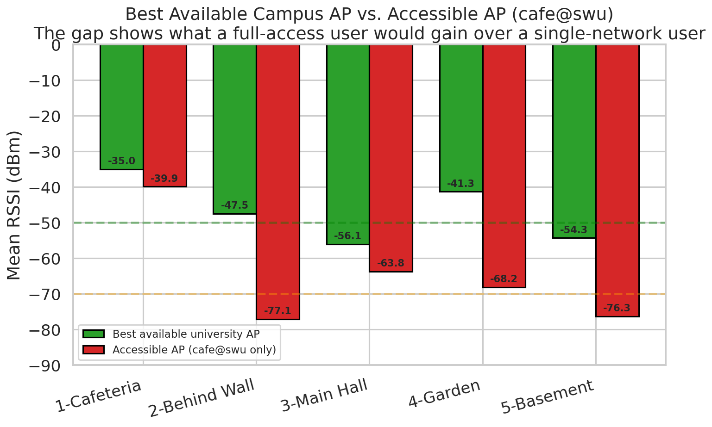
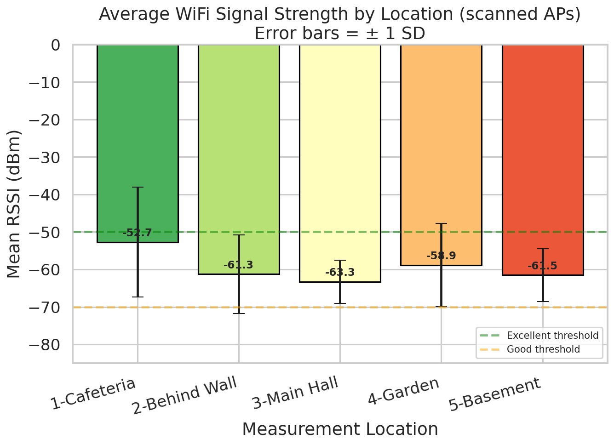
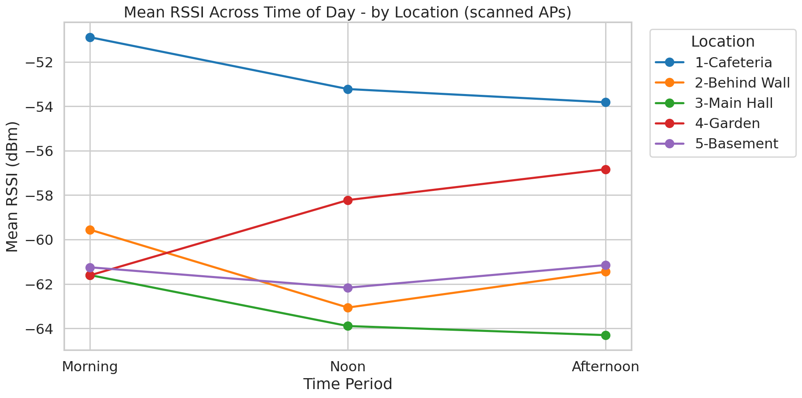
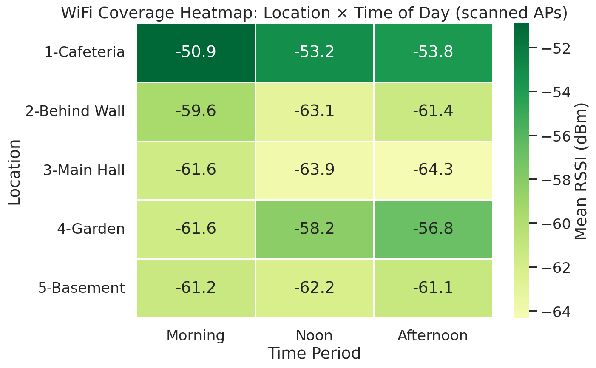
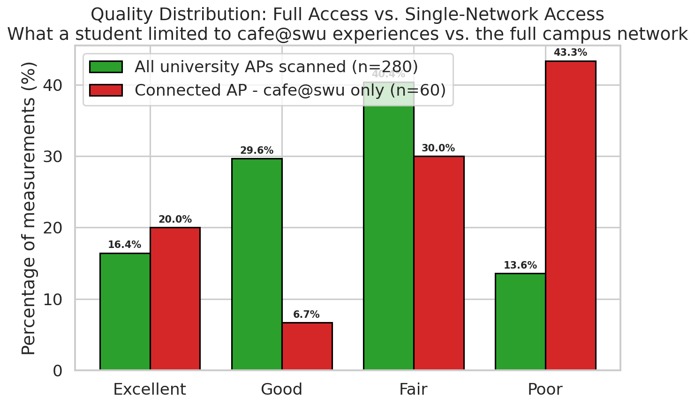
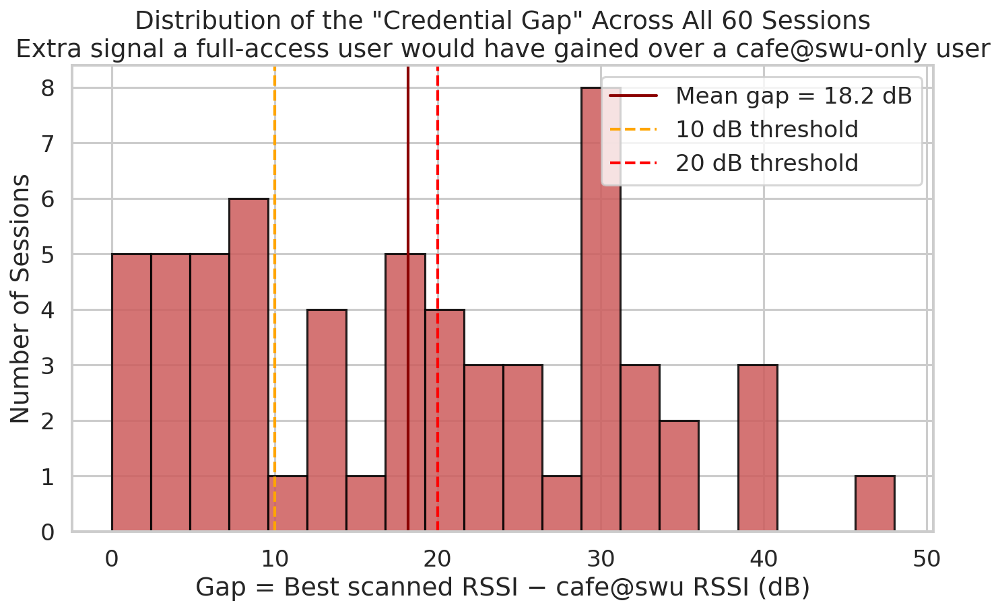

# WiFi Signal Strength Analysis — An IoT Approach to Campus Network Monitoring

[](https://opensource.org/licenses/MIT)
[](https://cran.r-project.org/)
[](https://www.tidyverse.org/)
[](#)
[](#)

> An IoT-based analysis of WiFi signal strength (RSSI) across a university campus, using a smartphone as the sensing device. Reveals an **18 dB credential gap** — the extra signal an Erasmus student would have gained with full-access credentials instead of the cafeteria-only network.

<p align="center">
  
</p>

---

## 🎯 Project Overview

This project was completed as part of an **IoT systems course** during an Erasmus exchange at South-West University "Neofit Rilski" (SWU), Bulgaria. The goal was to use a smartphone as an IoT sensing device to monitor WiFi coverage across multiple locations on campus, then analyze and visualize the collected data in R.

### What makes it interesting

Beyond the conventional coverage analysis, this project quantifies a very practical onboarding problem: newly arrived **Erasmus students often only have the password for `cafe@swu`**, a network whose access points are concentrated around the cafeteria. The study measures how much signal they lose compared to a student with credentials for the main `WiFi(at)SWU` network — and the answer turns out to be substantial.

### Key findings

| Metric | Value |
|---|---|
| Total sessions | 60 (4 days × 3 time periods × 5 locations) |
| Scanned AP detections (university SSIDs) | 280 |
| Location effect on RSSI | **p < 0.001** (highly significant) |
| Time-of-day effect | p = 0.80 (not significant) |
| Day-of-week effect | p = 0.79 (not significant) |
| **Mean credential gap** | **18.2 dB** |
| Sessions with gap ≥ 20 dB | **28 of 60 (47%)** |
| Poor-quality rate (cafe@swu only) | **43%** |
| Poor-quality rate (all university APs) | **14%** |

---

## 📂 Repository Structure

```
wifi-iot-monitoring/
├── README.md                          ← you are here
├── LICENSE                            ← MIT License
├── .gitignore
│
├── R/
│   └── wifi_analysis.R                ← Main R script (step-by-step, documented)
│
├── data/
│   ├── wifi_scans.csv                 ← 280 rows — all detected university APs
│   └── wifi_connected.csv             ← 60 rows  — the cafe@swu AP actually connected to
│
├── figures/                           ← 12 generated PNG charts
│
├── report/
│   └── WiFi_IoT_Report.docx           ← Full project report (Word)
│
└── docs/
    ├── methodology.md                 ← Detailed methodology
    ├── findings.md                    ← Extended discussion
    └── github-upload-guide.md         ← Upload guide (Turkish)
```

---

## 🔬 Methodology

### Measurement points (5)

| # | Location | Context |
|---|---|---|
| 1 | Cafeteria | High user density, close to an AP |
| 2 | Behind Concrete Wall | Structural obstruction |
| 3 | Main Hall | Transit area |
| 4 | Garden | Outdoor / open area |
| 5 | Basement | Expected dead zone |

### Schedule

- **4 working days:** Tuesday, Wednesday, Thursday, Friday (Monday was a public holiday)
- **3 sessions per day:** Morning, Noon, Afternoon
- **All 5 locations visited in the same order** in every session
- **Total:** 4 × 3 × 5 = 60 sessions

### Two complementary datasets

Rather than keeping only a single "best signal" value per location, this project uses **two linked datasets** to capture different aspects of network behavior:

1. **`wifi_scans.csv`** — every university AP the phone can see at each session. Describes the *radio environment*.
2. **`wifi_connected.csv`** — the `cafe@swu` access point the phone was actually associated with (the only campus network the researcher had credentials for). Describes the *single-network user experience*.

The difference between them is where the interesting analysis lives.

---

## 📊 Selected Results

### Location is the dominant factor (ANOVA p < 0.001)

<p align="center">
  
</p>

### Coverage is stable across time of day and day of week

<p align="center">
  
</p>

### Campus coverage heatmap (scanned APs)

<p align="center">
  
</p>

### Full access vs. single-network access — the credential gap

<p align="center">
  
</p>

> **Measured against all university APs, ~46% of detections are in the Good/Excellent range. But for a student limited to cafe@swu credentials, only 27% of sessions reach Good/Excellent — and 43% fall into Poor.**

### Distribution of the credential gap across all 60 sessions

<p align="center">
  
</p>

See [`figures/`](figures/) for all 12 charts, or [`report/WiFi_IoT_Report.docx`](report/) for the full write-up.

---

## 🚀 Reproducing the Analysis

### Prerequisites

- **R 4.0+** — [download from CRAN](https://cran.r-project.org/)
- **RStudio** (recommended) — [download free version](https://posit.co/download/rstudio-desktop/)

### Steps

```bash
# 1. Clone this repo
git clone https://github.com/Necro205/wifi-iot-monitoring.git
cd wifi-iot-monitoring

# 2. Open the R script in RStudio
#    File → Open File → R/wifi_analysis.R
#    Then: Session → Set Working Directory → To Project Directory
```

### Install required R packages (first time only)

```r
install.packages(c("tidyverse", "scales", "viridis", "RColorBrewer"))
```

### Run the full analysis

In RStudio, press **Ctrl+Shift+S** (or click **Source**). The script will:

- Load and tidy both datasets
- Compute descriptive statistics per location, time period, day, and SSID
- Run ANOVA tests and Tukey HSD post-hoc
- Compute the credential gap for each session
- Regenerate all 12 figures in `figures/`
- Write summary tables to an `output/` folder

---

## 📖 Report

The full academic report is available as a Word document in [`report/WiFi_IoT_Report.docx`](report/WiFi_IoT_Report.docx). It contains:

1. Introduction and objectives
2. Methodology (measurement setup, schedule, variables, two-dataset design)
3. Results (overall stats, per-location, per-time, per-day, SSID, credential-gap analysis)
4. Discussion (single-network access as a coverage issue, recommendations, limitations)
5. Conclusion

---

## 🧠 Discussion Highlights

### The credential gap

`cafe@swu` is clearly a network designed for the cafeteria area: its APs are concentrated there and its signal decays rapidly elsewhere on campus. `WiFi(at)SWU`, in contrast, has good building-wide coverage. The mean gap between the best available university-AP and the `cafe@swu` AP that a single-network user is restricted to is **18 dB** — roughly a factor of 60 in received power.

In practice, during their first weeks of onboarding, newly arrived Erasmus students often have only the `cafe@swu` password. That means they spend that onboarding window effectively without usable WiFi outside the cafeteria — even though the radio environment itself offers plenty of coverage.

### Recommendations

1. **Administrative:** streamline the distribution of `WiFi(at)SWU` credentials to arriving Erasmus and exchange students (e.g. as part of the welcome package), so they are not effectively limited to `cafe@swu`.
2. **Physical layer:** add or rebalance APs near the Main Hall and Basement — both offer only Fair scanned coverage with almost no headroom for interference.
3. **Network design:** consider extending `cafe@swu` beyond the cafeteria, or clearly communicating to students that it is a cafeteria-only network and not a substitute for the main campus WiFi.

---

## 🛠️ Tools Used

- **R** + **tidyverse** — data wrangling and visualization
- **ggplot2** — all figures
- **[WiFiAnalyzer](https://play.google.com/store/apps/details?id=com.vrem.wifianalyzer)** (Android) — measurement collection

---

## 📜 License

This project is released under the [MIT License](LICENSE). You are free to use, modify, and distribute this code and data, provided the original copyright notice is retained.

---

## 👤 Author

**Ramazan Karagöz** ([@Necro205](https://github.com/Necro205))
Erasmus Exchange Student in Statistics
Host University: South-West University "Neofit Rilski" (SWU), Blagoevgrad, Bulgaria
Academic year: 2025–2026

---

## 🙏 Acknowledgments

- **South-West University "Neofit Rilski"** for hosting the Erasmus exchange and providing the measurement environment.
- The open-source **R community** for the excellent tidyverse and ggplot2 ecosystems.
- **WiFiAnalyzer** developers for a free, high-quality WiFi scanner app.

---

## 📬 Feedback & Contributions

Found a mistake or have a suggestion? Feel free to [open an issue](../../issues) or submit a pull request. Contributions are welcome.

If you found this project useful, consider giving it a ⭐ — it helps other students and researchers discover it.
